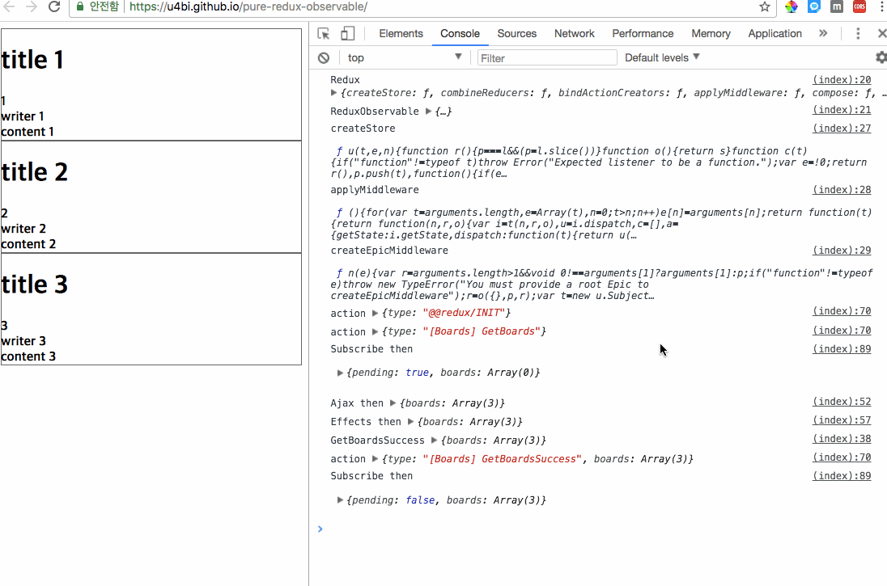

# Demo
> https://u4bi.github.io/pure-redux-observable

# USE

### API
> createStore : https://redux.js.org/docs/api/createStore.html <br>
> applyMiddleware : https://redux.js.org/docs/api/applyMiddleware.html <br>
> createEpicMiddleware : https://redux-observable.js.org/docs/api/createEpicMiddleware.html
```javascript
var createStore          = Redux.createStore,
    applyMiddleware      = Redux.applyMiddleware,
    createEpicMiddleware = ReduxObservable.createEpicMiddleware;
```

### Actions

```javascript
var GET_BOARDS         = '[Boards] GetBoards';
    GET_BOARDS_SUCCESS = '[Boards] GetBoardsSuccess';

var GetBoards        = () => ({ type : GET_BOARDS });
    GetBoardsSuccess = (boards) => {
        console.log('GetBoardsSuccess', boards);
        return ({ type : GET_BOARDS_SUCCESS, ...boards })
    };
```

### Effects

```javascript
var API_URL = 'https://cdn.rawgit.com/u4bi/pure-redux-observable/master/model/data.json';

var getBoards$ = (epic) => epic.ofType(GET_BOARDS)
                                .delay(1000)
                                .switchMap((action) => {
                                    return Rx.Observable.ajax({
                                        url : API_URL,
                                        method : 'GET',
                                        crossDomain : true
                                    }).map(e => {
                                        console.log('Ajax then', e.response);
                                        return e.response
                                    }).catch(err => console.error(err));
                                })
                                .map(v => {
                                    console.log('Effects then', v);
                                    return GetBoardsSuccess(v)
                                });
```

### Reducer

```javascript
var initialState = {
        pending: false,
        boards : []
    },
    newState = (state, newData) => Object.assign({}, state, newData);

var boardsReducer = (state = initialState, action) => {
    console.log('action', action);

    switch (action.type) {
        case GET_BOARDS:
            return newState(state, { pending: true });
        case GET_BOARDS_SUCCESS:
            return newState(state, { pending: false, boards : action.boards });
        default : state;
    }
};
```

### App
```javascript
var effects = createEpicMiddleware(getBoards$);
    store   = createStore(boardsReducer, applyMiddleware(effects)),
    element = document.getElementById('app');

store.subscribe( () => {
    let data = store.getState();
    console.log('Subscribe then\n\n', data, '\n\n');

    /*------- View Rendering ---------------------------------------------*/
    data.pending ? element.innerHTML = '<h1>Loading</h1>' : [
        element.innerHTML = '',
        data.boards.map(v => {
            let childrenElement = document.createElement('div');
            childrenElement.className = 'item'
            childrenElement.innerHTML = `
                <h1>${ v.title }</h1>
                <h4>${ v.id }</h4>
                <h4>${ v.writer }</h4>
                <h4>${ v.content}</h4>
            `;
            element.appendChild(childrenElement);
        })
    ];
    /*--------------------------------------------------------------------*/

});

store.dispatch(GetBoards());
```

> ## Requirements
> | Library                | URL                                                  |
> |------------------------|------------------------------------------------------|
> | Redux                  | https://redux.js.org                                 |
> | RxJS                   | http://reactivex.io/rxjs                             |
> | redux-observable       | https://redux-observable.js.org                      |
___

## More ...
https://github.com/u4bi-git/ngrx-crud-side-effect-GraphQL-and-RESTful